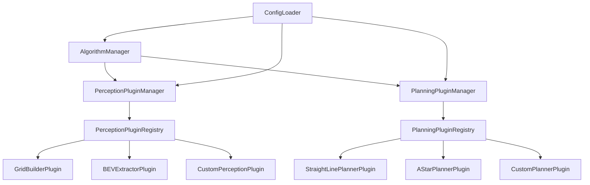

# NavSim-Local 插件化架构重构设计方案

## 文档版本
- **版本**: v1.0
- **日期**: 2025-10-13
- **作者**: Architecture Team
- **状态**: 设计阶段

---

## 1. 概述

### 1.1 重构目标

将 `navsim-local` 从当前的硬编码架构重构为**插件化、可扩展、可配置**的架构，使用户能够：

1. **感知处理插件化**：自定义感知数据转换逻辑
2. **规划器插件化**：新增和适配不同的规划算法
3. **配置驱动**：通过配置文件控制插件加载和参数
4. **易于扩展**：添加新插件无需修改核心代码

### 1.2 设计原则

- ✅ **开放-封闭原则**：对扩展开放，对修改封闭
- ✅ **依赖倒置原则**：依赖抽象接口，不依赖具体实现
- ✅ **单一职责原则**：每个插件只负责一个功能
- ✅ **向后兼容**：保证现有功能不受影响
- ✅ **简单实用**：避免过度设计，优先实用性

### 1.3 技术约束

- **C++ 版本**: C++17
- **平台**: Linux (主要), 跨平台兼容
- **依赖**: 最小化外部依赖
- **性能**: 插件加载开销 < 10ms

---

## 2. 整体架构设计

### 2.1 架构分层

```
┌─────────────────────────────────────────────────────────────┐
│                     Application Layer                       │
│                  (main.cpp, CLI, Config)                    │
└─────────────────────────────────────────────────────────────┘
                              ▼
┌─────────────────────────────────────────────────────────────┐
│                   Algorithm Manager                         │
│          (Orchestrates Perception + Planning)               │
└─────────────────────────────────────────────────────────────┘
                              ▼
        ┌─────────────────────────────────────┐
        │                                     │
        ▼                                     ▼
┌──────────────────┐                ┌──────────────────┐
│ Perception       │                │ Planning         │
│ Plugin Manager   │                │ Plugin Manager   │
└──────────────────┘                └──────────────────┘
        │                                     │
        ▼                                     ▼
┌──────────────────┐                ┌──────────────────┐
│ Plugin Registry  │                │ Plugin Registry  │
│ (Factory)        │                │ (Factory)        │
└──────────────────┘                └──────────────────┘
        │                                     │
        ▼                                     ▼
┌──────────────────┐                ┌──────────────────┐
│ Perception       │                │ Planner          │
│ Plugins          │                │ Plugins          │
│ - GridBuilder    │                │ - StraightLine   │
│ - BEVExtractor   │                │ - AStar          │
│ - Predictor      │                │ - Optimization   │
│ - [Custom...]    │                │ - [Custom...]    │
└──────────────────┘                └──────────────────┘
```

### 2.2 核心组件

| 组件 | 职责 | 实现方式 |
|------|------|----------|
| **PluginInterface** | 定义插件抽象接口 | 纯虚基类 |
| **PluginRegistry** | 插件注册和发现 | 单例 + 工厂模式 |
| **PluginManager** | 插件生命周期管理 | 管理类 |
| **ConfigLoader** | 配置文件加载 | JSON 解析器 |
| **PluginLoader** | 动态库加载（可选） | dlopen/dlsym |

### 2.3 依赖关系图



---

## 3. 插件接口设计

### 3.1 感知处理插件接口

#### 3.1.1 架构分层说明

感知处理分为两层：

1. **公共前置处理层**（非插件，固定流程）
   - BEV 数据提取器：解析 `proto::WorldTick` 中的障碍物数据
   - 动态障碍物预测器：生成动态障碍物的预测轨迹
   - 基础数据转换器：提取自车状态、任务目标等

2. **感知插件层**（可扩展）
   - 接收标准化的中间数据
   - 专注于特定地图表示的构建
   - 用户可自定义插件

**数据流**:
```
proto::WorldTick (上游话题)
    ↓
[公共前置处理层] - 固定流程
├─ BEV 数据提取器
├─ 动态障碍物预测器
└─ 基础数据转换器
    ↓
PerceptionInput (标准化中间数据)
    ↓
[感知插件层] - 可扩展
├─ GridMapBuilderPlugin (栅格地图)
├─ PointCloudMapBuilderPlugin (点云地图)
├─ ESDFBuilderPlugin (距离场)
└─ [用户自定义插件]
    ↓
planning::PlanningContext (输出)
```

#### 3.1.2 标准化输入数据结构

```cpp
// include/plugin/perception_input.hpp
namespace navsim {
namespace plugin {

/**
 * @brief 感知插件的标准化输入数据
 * 由公共前置处理层生成，供所有感知插件使用
 */
struct PerceptionInput {
  // ========== 基础数据 ==========
  planning::EgoVehicle ego;           // 自车状态
  planning::PlanningTask task;        // 规划任务
  double timestamp = 0.0;             // 当前时间戳
  uint64_t tick_id = 0;               // Tick ID

  // ========== 已解析的标准化数据 ==========
  // 由公共前置处理层提供，所有插件可直接使用

  /**
   * @brief BEV 障碍物表示
   * 包含静态和动态障碍物的几何表示（圆形、矩形、多边形）
   */
  planning::BEVObstacles bev_obstacles;

  /**
   * @brief 动态障碍物预测
   * 包含动态障碍物的当前状态和预测轨迹
   */
  std::vector<planning::DynamicObstacle> dynamic_obstacles;

  // ========== 原始数据（可选） ==========
  // 供高级插件访问原始数据，避免拷贝使用指针

  /**
   * @brief 原始世界状态消息（只读）
   * 高级插件可访问原始数据进行自定义处理
   */
  const proto::WorldTick* raw_world_tick = nullptr;

  // ========== 工具函数 ==========

  /**
   * @brief 检查是否有原始数据
   */
  bool hasRawData() const { return raw_world_tick != nullptr; }
};

} // namespace plugin
} // namespace navsim
```

#### 3.1.3 感知插件接口定义

```cpp
// include/plugin/perception_plugin_interface.hpp
namespace navsim {
namespace plugin {

/**
 * @brief 感知处理插件抽象接口
 *
 * 职责：从标准化的感知输入构建特定的地图表示
 * 示例：栅格地图、点云地图、ESDF 距离场、代价地图等
 *
 * 注意：感知插件不负责解析原始数据，原始数据已由公共前置处理层处理
 */
class PerceptionPluginInterface {
public:
  virtual ~PerceptionPluginInterface() = default;

  /**
   * @brief 插件元信息
   */
  struct Metadata {
    std::string name;           // 插件名称 (唯一标识)
    std::string version;        // 版本号 (e.g., "1.0.0")
    std::string description;    // 描述
    std::string author;         // 作者
    std::vector<std::string> dependencies; // 依赖的其他插件
    bool requires_raw_data = false;  // 是否需要访问原始数据
  };

  /**
   * @brief 获取插件元信息
   */
  virtual Metadata getMetadata() const = 0;

  /**
   * @brief 初始化插件
   * @param config 插件配置 (JSON 格式)
   * @return 初始化是否成功
   */
  virtual bool initialize(const nlohmann::json& config) = 0;

  /**
   * @brief 处理感知数据，构建地图表示
   * @param input 标准化的感知输入数据（由公共前置处理层提供）
   * @param context 输出的规划上下文 (会被修改)
   * @return 处理是否成功
   */
  virtual bool process(const PerceptionInput& input,
                      planning::PlanningContext& context) = 0;

  /**
   * @brief 重置插件状态
   */
  virtual void reset() {}

  /**
   * @brief 获取插件统计信息
   */
  virtual nlohmann::json getStatistics() const { return {}; }

  /**
   * @brief 检查插件是否可用
   */
  virtual bool isAvailable() const { return true; }
};

} // namespace plugin
} // namespace navsim
```

#### 3.1.4 输入/输出数据结构总结

**输入**: `PerceptionInput` (标准化中间数据)
- 自车状态 (`ego`)
- 任务目标 (`task`)
- BEV 障碍物 (`bev_obstacles`) - 已解析
- 动态障碍物预测 (`dynamic_obstacles`) - 已解析
- 原始数据 (`raw_world_tick`) - 可选，供高级插件使用

**输出**: `planning::PlanningContext` (已定义)
- 栅格地图 (`occupancy_grid`) - 由 GridMapBuilderPlugin 填充
- 点云地图 (`point_cloud_map`) - 由 PointCloudMapBuilderPlugin 填充
- ESDF 距离场 (`esdf_map`) - 由 ESDFBuilderPlugin 填充
- 自定义数据 (`custom_data`) - 由自定义插件填充

#### 3.1.5 感知插件示例

##### 示例 1: 栅格地图构建插件

```cpp
// plugins/perception/grid_map_builder_plugin.hpp
namespace navsim {
namespace plugin {

/**
 * @brief 栅格地图构建插件
 * 从 BEV 障碍物构建栅格占据地图
 */
class GridMapBuilderPlugin : public PerceptionPluginInterface {
public:
  Metadata getMetadata() const override {
    return {
      .name = "GridMapBuilderPlugin",
      .version = "1.0.0",
      .description = "Builds occupancy grid from BEV obstacles",
      .author = "NavSim Team",
      .dependencies = {},
      .requires_raw_data = false  // 不需要原始数据
    };
  }

  bool initialize(const nlohmann::json& config) override {
    // 从 config 读取参数
    resolution_ = config.value("resolution", 0.1);
    map_width_ = config.value("map_width", 100.0);
    map_height_ = config.value("map_height", 100.0);
    inflation_radius_ = config.value("inflation_radius", 0.3);
    obstacle_cost_ = config.value("obstacle_cost", 100);

    std::cout << "[GridMapBuilder] Initialized with resolution="
              << resolution_ << "m" << std::endl;
    return true;
  }

  bool process(const PerceptionInput& input,
              planning::PlanningContext& context) override {
    // 创建栅格地图
    auto grid = std::make_unique<planning::OccupancyGrid>();

    // 配置地图参数
    grid->config.origin = {input.ego.pose.x - map_width_ / 2,
                          input.ego.pose.y - map_height_ / 2};
    grid->config.resolution = resolution_;
    grid->config.width = static_cast<int>(map_width_ / resolution_);
    grid->config.height = static_cast<int>(map_height_ / resolution_);

    // 初始化地图数据
    grid->data.resize(grid->config.width * grid->config.height, 0);

    // 从 BEV 障碍物填充栅格地图
    fillGridFromBEVObstacles(input.bev_obstacles, *grid);

    // 膨胀障碍物
    inflateObstacles(*grid, inflation_radius_);

    // 输出到规划上下文
    context.occupancy_grid = std::move(grid);

    return true;
  }

private:
  double resolution_;
  double map_width_;
  double map_height_;
  double inflation_radius_;
  uint8_t obstacle_cost_;

  void fillGridFromBEVObstacles(const planning::BEVObstacles& obstacles,
                                planning::OccupancyGrid& grid) {
    // 处理圆形障碍物
    for (const auto& circle : obstacles.circles) {
      fillCircle(grid, circle.center, circle.radius);
    }

    // 处理矩形障碍物
    for (const auto& rect : obstacles.rectangles) {
      fillRectangle(grid, rect.pose, rect.width, rect.height);
    }

    // 处理多边形障碍物
    for (const auto& polygon : obstacles.polygons) {
      fillPolygon(grid, polygon.vertices);
    }
  }

  void fillCircle(planning::OccupancyGrid& grid,
                 const planning::Point2d& center, double radius) {
    // 实现圆形填充逻辑...
  }

  void fillRectangle(planning::OccupancyGrid& grid,
                    const planning::Pose2d& pose,
                    double width, double height) {
    // 实现矩形填充逻辑...
  }

  void fillPolygon(planning::OccupancyGrid& grid,
                  const std::vector<planning::Point2d>& vertices) {
    // 实现多边形填充逻辑...
  }

  void inflateObstacles(planning::OccupancyGrid& grid, double radius) {
    // 实现障碍物膨胀逻辑...
  }
};

// 插件注册宏
REGISTER_PERCEPTION_PLUGIN(GridMapBuilderPlugin)

} // namespace plugin
} // namespace navsim
```

##### 示例 2: ESDF 距离场构建插件

```cpp
// plugins/perception/esdf_builder_plugin.hpp
namespace navsim {
namespace plugin {

/**
 * @brief ESDF 距离场构建插件
 * 从 BEV 障碍物构建 Euclidean Signed Distance Field
 */
class ESDFBuilderPlugin : public PerceptionPluginInterface {
public:
  Metadata getMetadata() const override {
    return {
      .name = "ESDFBuilderPlugin",
      .version = "1.0.0",
      .description = "Builds ESDF from BEV obstacles",
      .author = "NavSim Team",
      .dependencies = {},
      .requires_raw_data = false
    };
  }

  bool initialize(const nlohmann::json& config) override {
    resolution_ = config.value("resolution", 0.1);
    max_distance_ = config.value("max_distance", 10.0);
    return true;
  }

  bool process(const PerceptionInput& input,
              planning::PlanningContext& context) override {
    // 构建 ESDF 距离场
    auto esdf = buildESDFFromBEV(input.bev_obstacles);

    // 存储到自定义数据
    context.setCustomData("esdf_map", esdf);

    return true;
  }

private:
  double resolution_;
  double max_distance_;

  std::shared_ptr<ESDFMap> buildESDFFromBEV(
      const planning::BEVObstacles& obstacles) {
    // 实现 ESDF 构建逻辑...
    return std::make_shared<ESDFMap>();
  }
};

REGISTER_PERCEPTION_PLUGIN(ESDFBuilderPlugin)

} // namespace plugin
} // namespace navsim
```

##### 示例 3: 自定义插件（访问原始数据）

```cpp
// plugins/perception/custom_sensor_plugin.hpp
namespace navsim {
namespace plugin {

/**
 * @brief 自定义传感器数据处理插件
 * 需要访问原始数据进行自定义处理
 */
class CustomSensorPlugin : public PerceptionPluginInterface {
public:
  Metadata getMetadata() const override {
    return {
      .name = "CustomSensorPlugin",
      .version = "1.0.0",
      .description = "Custom sensor data processing",
      .author = "User",
      .dependencies = {},
      .requires_raw_data = true  // 需要原始数据
    };
  }

  bool initialize(const nlohmann::json& config) override {
    // 初始化...
    return true;
  }

  bool process(const PerceptionInput& input,
              planning::PlanningContext& context) override {
    // 检查是否有原始数据
    if (!input.hasRawData()) {
      std::cerr << "[CustomSensor] ERROR: Raw data not available" << std::endl;
      return false;
    }

    // 访问原始数据进行自定义处理
    const auto& world_tick = *input.raw_world_tick;

    // 处理自定义传感器数据
    // 例如：处理激光雷达点云、相机图像等

    // 也可以使用标准化数据
    const auto& bev_obstacles = input.bev_obstacles;

    // 输出自定义数据
    auto custom_data = processCustomSensor(world_tick);
    context.setCustomData("custom_sensor_data", custom_data);

    return true;
  }

private:
  std::shared_ptr<void> processCustomSensor(const proto::WorldTick& world_tick) {
    // 实现自定义处理逻辑...
    return nullptr;
  }
};

REGISTER_PERCEPTION_PLUGIN(CustomSensorPlugin)

} // namespace plugin
} // namespace navsim
```

#### 3.1.6 公共前置处理层设计

公共前置处理层负责将原始的 `proto::WorldTick` 解析为标准化的 `PerceptionInput`，供所有感知插件使用。

##### 前置处理模块

```cpp
// include/perception/preprocessing.hpp
namespace navsim {
namespace perception {

/**
 * @brief BEV 数据提取器
 * 从 WorldTick 中提取 BEV 障碍物表示
 */
class BEVExtractor {
public:
  struct Config {
    double detection_range = 50.0;      // 检测范围 (m)
    double confidence_threshold = 0.5;  // 置信度阈值
    bool include_static = true;         // 是否包含静态障碍物
    bool include_dynamic = true;        // 是否包含动态障碍物
  };

  explicit BEVExtractor(const Config& config);

  /**
   * @brief 提取 BEV 障碍物
   */
  bool extract(const proto::WorldTick& world_tick,
              planning::BEVObstacles& bev_obstacles);

private:
  Config config_;
  proto::StaticMap cached_static_map_;  // 静态地图缓存
  bool has_cached_static_map_ = false;
};

/**
 * @brief 动态障碍物预测器
 * 为动态障碍物生成预测轨迹
 */
class DynamicObstaclePredictor {
public:
  struct Config {
    double prediction_horizon = 5.0;   // 预测时域 (s)
    double time_step = 0.1;           // 时间步长 (s)
    int max_trajectories = 3;         // 每个障碍物最大轨迹数
    std::string prediction_model = "constant_velocity"; // 预测模型
  };

  explicit DynamicObstaclePredictor(const Config& config);

  /**
   * @brief 预测动态障碍物轨迹
   */
  bool predict(const proto::WorldTick& world_tick,
              std::vector<planning::DynamicObstacle>& dynamic_obstacles);

private:
  Config config_;

  void predictConstantVelocity(const proto::WorldTick& world_tick,
                              std::vector<planning::DynamicObstacle>& obstacles);
  void predictConstantAcceleration(const proto::WorldTick& world_tick,
                                  std::vector<planning::DynamicObstacle>& obstacles);
};

/**
 * @brief 基础数据转换器
 * 提取自车状态、任务目标等基础数据
 */
class BasicDataConverter {
public:
  /**
   * @brief 转换自车状态
   */
  static planning::EgoVehicle convertEgo(const proto::WorldTick& world_tick);

  /**
   * @brief 转换任务目标
   */
  static planning::PlanningTask convertTask(const proto::WorldTick& world_tick);
};

} // namespace perception
} // namespace navsim
```

##### 感知插件管理器（集成前置处理）

```cpp
// include/plugin/perception_plugin_manager.hpp
namespace navsim {
namespace plugin {

/**
 * @brief 感知插件管理器
 * 负责：
 * 1. 公共前置处理（BEV 提取、动态障碍物预测）
 * 2. 加载、初始化、执行感知插件
 */
class PerceptionPluginManager {
public:
  struct Config {
    // 前置处理配置
    perception::BEVExtractor::Config bev_config;
    perception::DynamicObstaclePredictor::Config predictor_config;

    // 插件配置列表
    struct PluginConfig {
      std::string name;           // 插件名称
      bool enabled = true;        // 是否启用
      int priority = 0;           // 执行优先级
      nlohmann::json params;      // 插件参数
    };
    std::vector<PluginConfig> plugins;
  };

  PerceptionPluginManager() = default;

  /**
   * @brief 从配置加载
   */
  bool loadFromConfig(const Config& config) {
    // 初始化前置处理模块
    bev_extractor_ = std::make_unique<perception::BEVExtractor>(config.bev_config);
    obstacle_predictor_ = std::make_unique<perception::DynamicObstaclePredictor>(
        config.predictor_config);

    // 加载感知插件
    for (const auto& plugin_cfg : config.plugins) {
      if (!plugin_cfg.enabled) {
        continue;
      }

      auto plugin = PerceptionPluginRegistry::instance().createPlugin(plugin_cfg.name);
      if (!plugin) {
        std::cerr << "[PerceptionPluginManager] Failed to create plugin: "
                  << plugin_cfg.name << std::endl;
        return false;
      }

      if (!plugin->initialize(plugin_cfg.params)) {
        std::cerr << "[PerceptionPluginManager] Failed to initialize plugin: "
                  << plugin_cfg.name << std::endl;
        return false;
      }

      plugins_.push_back({
        .plugin = std::move(plugin),
        .priority = plugin_cfg.priority,
        .enabled = true
      });
    }

    // 按优先级排序
    std::sort(plugins_.begin(), plugins_.end(),
              [](const auto& a, const auto& b) { return a.priority < b.priority; });

    return true;
  }

  /**
   * @brief 处理世界状态，生成规划上下文
   */
  bool process(const proto::WorldTick& world_tick,
              planning::PlanningContext& context) {
    // ========== 步骤 1: 公共前置处理 ==========
    PerceptionInput input;

    // 1.1 提取基础数据
    input.ego = perception::BasicDataConverter::convertEgo(world_tick);
    input.task = perception::BasicDataConverter::convertTask(world_tick);
    input.timestamp = world_tick.stamp();
    input.tick_id = world_tick.tick_id();

    // 1.2 提取 BEV 障碍物
    if (!bev_extractor_->extract(world_tick, input.bev_obstacles)) {
      std::cerr << "[PerceptionPluginManager] BEV extraction failed" << std::endl;
      return false;
    }

    // 1.3 预测动态障碍物
    if (!obstacle_predictor_->predict(world_tick, input.dynamic_obstacles)) {
      std::cerr << "[PerceptionPluginManager] Obstacle prediction failed" << std::endl;
      return false;
    }

    // 1.4 保存原始数据引用（供需要的插件使用）
    input.raw_world_tick = &world_tick;

    // 1.5 填充基础上下文
    context.ego = input.ego;
    context.task = input.task;
    context.timestamp = input.timestamp;
    context.dynamic_obstacles = input.dynamic_obstacles;  // 直接填充

    // ========== 步骤 2: 执行感知插件 ==========
    for (auto& entry : plugins_) {
      if (!entry.enabled) {
        continue;
      }

      if (!entry.plugin->process(input, context)) {
        std::cerr << "[PerceptionPluginManager] Plugin failed: "
                  << entry.plugin->getMetadata().name << std::endl;
        return false;
      }
    }

    return true;
  }

  /**
   * @brief 启用/禁用插件
   */
  void enablePlugin(const std::string& name, bool enabled) {
    for (auto& entry : plugins_) {
      if (entry.plugin->getMetadata().name == name) {
        entry.enabled = enabled;
        break;
      }
    }
  }

private:
  // 公共前置处理模块（非插件）
  std::unique_ptr<perception::BEVExtractor> bev_extractor_;
  std::unique_ptr<perception::DynamicObstaclePredictor> obstacle_predictor_;

  // 感知插件列表
  struct PluginEntry {
    std::unique_ptr<PerceptionPluginInterface> plugin;
    int priority;
    bool enabled;
  };
  std::vector<PluginEntry> plugins_;
};

} // namespace plugin
} // namespace navsim
```

**关键设计要点**:

1. **前置处理固定流程**: BEV 提取和动态障碍物预测作为固定步骤，不是插件
2. **标准化数据**: 所有插件接收相同的标准化输入 `PerceptionInput`
3. **插件专注性**: 感知插件只负责构建特定的地图表示
4. **原始数据可选**: 高级插件可访问原始数据，但不是必需的
5. **清晰分层**: 前置处理层 → 插件层 → 规划上下文

### 3.2 规划器插件接口

#### 3.2.1 核心接口定义

```cpp
// include/plugin/planner_plugin_interface.hpp
namespace navsim {
namespace plugin {

/**
 * @brief 规划器插件抽象接口
 * 所有规划器插件必须实现此接口
 */
class PlannerPluginInterface {
public:
  virtual ~PlannerPluginInterface() = default;

  /**
   * @brief 插件元信息
   */
  struct Metadata {
    std::string name;           // 插件名称 (唯一标识)
    std::string version;        // 版本号
    std::string description;    // 描述
    std::string type;           // 类型 (geometric/search/optimization/learning)
    std::string author;         // 作者
    std::vector<std::string> dependencies; // 依赖的其他插件
    std::vector<std::string> required_perception; // 需要的感知数据
  };

  /**
   * @brief 获取插件元信息
   */
  virtual Metadata getMetadata() const = 0;

  /**
   * @brief 初始化插件
   * @param config 插件配置 (JSON 格式)
   * @return 初始化是否成功
   */
  virtual bool initialize(const nlohmann::json& config) = 0;

  /**
   * @brief 规划主函数
   * @param context 规划上下文 (输入)
   * @param deadline 规划截止时间
   * @param result 规划结果 (输出)
   * @return 规划是否成功
   */
  virtual bool plan(const planning::PlanningContext& context,
                   std::chrono::milliseconds deadline,
                   planning::PlanningResult& result) = 0;

  /**
   * @brief 检查规划器是否可用
   * @param context 规划上下文
   * @return 是否可用及原因
   */
  virtual std::pair<bool, std::string> isAvailable(
      const planning::PlanningContext& context) const = 0;

  /**
   * @brief 重置规划器状态
   */
  virtual void reset() {}

  /**
   * @brief 获取插件统计信息
   */
  virtual nlohmann::json getStatistics() const { return {}; }

  /**
   * @brief 获取/设置参数 (运行时调参)
   */
  virtual nlohmann::json getParameters() const { return {}; }
  virtual bool setParameter(const std::string& name, double value) { return false; }
};

} // namespace plugin
} // namespace navsim
```

#### 3.2.2 插件示例

```cpp
// plugins/planning/astar_planner_plugin.hpp
class AStarPlannerPlugin : public PlannerPluginInterface {
public:
  Metadata getMetadata() const override {
    return {
      .name = "AStarPlannerPlugin",
      .version = "1.0.0",
      .description = "A* path planning algorithm",
      .type = "search",
      .author = "NavSim Team",
      .dependencies = {},
      .required_perception = {"occupancy_grid"}  // 需要栅格地图
    };
  }

  bool initialize(const nlohmann::json& config) override {
    heuristic_weight_ = config.value("heuristic_weight", 1.0);
    max_iterations_ = config.value("max_iterations", 10000);
    // ...
    return true;
  }

  bool plan(const planning::PlanningContext& context,
           std::chrono::milliseconds deadline,
           planning::PlanningResult& result) override {
    // 检查是否有栅格地图
    if (!context.occupancy_grid) {
      result.status = planning::PlanningResult::Status::INVALID_INPUT;
      result.diagnostics.failure_reason = "Missing occupancy grid";
      return false;
    }

    // 实现 A* 规划逻辑
    // ...
    return true;
  }

  std::pair<bool, std::string> isAvailable(
      const planning::PlanningContext& context) const override {
    if (!context.occupancy_grid) {
      return {false, "Missing occupancy grid"};
    }
    return {true, ""};
  }

private:
  double heuristic_weight_;
  int max_iterations_;
  // ...
};

// 插件注册宏
REGISTER_PLANNER_PLUGIN(AStarPlannerPlugin)
```

---

## 4. 插件管理机制

### 4.1 插件注册方式对比

| 方式 | 优点 | 缺点 | 推荐度 |
|------|------|------|--------|
| **编译时注册** | 简单、快速、类型安全 | 需要重新编译 | ⭐⭐⭐⭐⭐ |
| **运行时动态加载** | 无需重新编译、热插拔 | 复杂、跨平台问题 | ⭐⭐⭐ |

**推荐方案**: **编译时注册 + 可选的运行时加载**

- **Phase 1**: 实现编译时注册（简单、稳定）
- **Phase 2**: 可选支持动态库加载（高级功能）

### 4.2 编译时注册机制

#### 4.2.1 注册宏定义

```cpp
// include/plugin/plugin_registry.hpp
namespace navsim {
namespace plugin {

// 感知插件注册宏
#define REGISTER_PERCEPTION_PLUGIN(PluginClass) \
  namespace { \
    static bool _registered_##PluginClass = \
      PerceptionPluginRegistry::instance().registerPlugin( \
        #PluginClass, \
        []() -> std::unique_ptr<PerceptionPluginInterface> { \
          return std::make_unique<PluginClass>(); \
        }); \
  }

// 规划器插件注册宏
#define REGISTER_PLANNER_PLUGIN(PluginClass) \
  namespace { \
    static bool _registered_##PluginClass = \
      PlannerPluginRegistry::instance().registerPlugin( \
        #PluginClass, \
        []() -> std::unique_ptr<PlannerPluginInterface> { \
          return std::make_unique<PluginClass>(); \
        }); \
  }

} // namespace plugin
} // namespace navsim
```

#### 4.2.2 插件注册表

```cpp
// include/plugin/plugin_registry.hpp
namespace navsim {
namespace plugin {

/**
 * @brief 感知插件注册表 (单例)
 */
class PerceptionPluginRegistry {
public:
  using FactoryFunc = std::function<std::unique_ptr<PerceptionPluginInterface>()>;

  static PerceptionPluginRegistry& instance() {
    static PerceptionPluginRegistry registry;
    return registry;
  }

  /**
   * @brief 注册插件
   */
  bool registerPlugin(const std::string& name, FactoryFunc factory) {
    auto [it, inserted] = factories_.emplace(name, std::move(factory));
    if (!inserted) {
      std::cerr << "[PluginRegistry] WARNING: Plugin '" << name 
                << "' already registered" << std::endl;
    }
    return inserted;
  }

  /**
   * @brief 创建插件实例
   */
  std::unique_ptr<PerceptionPluginInterface> createPlugin(const std::string& name) {
    auto it = factories_.find(name);
    if (it == factories_.end()) {
      std::cerr << "[PluginRegistry] ERROR: Plugin '" << name 
                << "' not found" << std::endl;
      return nullptr;
    }
    return it->second();
  }

  /**
   * @brief 获取所有已注册的插件名称
   */
  std::vector<std::string> getRegisteredPlugins() const {
    std::vector<std::string> names;
    for (const auto& [name, _] : factories_) {
      names.push_back(name);
    }
    return names;
  }

private:
  PerceptionPluginRegistry() = default;
  std::unordered_map<std::string, FactoryFunc> factories_;
};

/**
 * @brief 规划器插件注册表 (单例)
 */
class PlannerPluginRegistry {
  // 类似实现...
};

} // namespace plugin
} // namespace navsim
```

### 4.3 插件管理器设计

#### 4.3.1 感知插件管理器

负责加载、初始化、执行感知插件，按优先级顺序处理。

**核心功能**:
- 从配置加载插件列表
- 按优先级排序执行
- 支持运行时启用/禁用插件
- 错误处理和日志记录

#### 4.3.2 规划器插件管理器

负责加载、选择、执行规划器插件，支持自动降级。

**核心功能**:
- 加载主规划器和降级规划器
- 检查规划器可用性
- 自动降级机制
- 运行时切换规划器

### 4.4 插件生命周期

```
┌─────────────────────────────────────────────────────────────┐
│                    Plugin Lifecycle                         │
└─────────────────────────────────────────────────────────────┘

1. Registration (编译时)
   ├─ REGISTER_PERCEPTION_PLUGIN(PluginClass)
   └─ 插件工厂函数注册到 PluginRegistry

2. Discovery (启动时)
   ├─ ConfigLoader 读取配置文件
   └─ 确定需要加载的插件列表

3. Creation (启动时)
   ├─ PluginManager 从 PluginRegistry 创建实例
   └─ 调用插件的构造函数

4. Initialization (启动时)
   ├─ 调用 plugin->initialize(config)
   └─ 插件读取配置参数并初始化内部状态

5. Execution (运行时)
   ├─ 感知插件: process(world_tick, context)
   └─ 规划器插件: plan(context, deadline, result)

6. Reset (可选)
   └─ 调用 plugin->reset() 重置状态

7. Destruction (关闭时)
   └─ 智能指针自动析构
```

---

## 5. 配置系统设计

### 5.1 配置文件格式选择

| 格式 | 优点 | 缺点 | 推荐度 |
|------|------|------|--------|
| **JSON** | 简单、已有依赖 (nlohmann/json) | 不支持注释 | ⭐⭐⭐⭐⭐ |
| **YAML** | 可读性好、支持注释 | 需要额外依赖 | ⭐⭐⭐⭐ |
| **TOML** | 简洁、支持注释 | 需要额外依赖 | ⭐⭐⭐ |

**推荐方案**: **JSON** (已有依赖，零成本)

**替代方案**: 支持 JSON5 风格的注释（通过预处理去除注释行）

### 5.2 配置文件结构

```json
{
  "version": "1.0",
  "algorithm": {
    "max_computation_time_ms": 25.0,
    "verbose_logging": false
  },

  "perception": {
    "preprocessing": {
      "bev_extraction": {
        "detection_range": 50.0,
        "confidence_threshold": 0.5,
        "include_static": true,
        "include_dynamic": true
      },
      "dynamic_prediction": {
        "prediction_horizon": 5.0,
        "time_step": 0.1,
        "max_trajectories": 3,
        "prediction_model": "constant_velocity"
      }
    },

    "plugins": [
      {
        "name": "GridMapBuilderPlugin",
        "enabled": true,
        "priority": 1,
        "params": {
          "resolution": 0.1,
          "map_width": 100.0,
          "map_height": 100.0,
          "inflation_radius": 0.3,
          "obstacle_cost": 100
        }
      },
      {
        "name": "ESDFBuilderPlugin",
        "enabled": false,
        "priority": 2,
        "params": {
          "resolution": 0.1,
          "max_distance": 10.0
        }
      }
    ]
  },

  "planning": {
    "primary_planner": "AStarPlannerPlugin",
    "fallback_planner": "StraightLinePlannerPlugin",
    "enable_fallback": true,

    "planners": {
      "StraightLinePlannerPlugin": {
        "time_step": 0.1,
        "default_velocity": 2.0,
        "max_acceleration": 2.0,
        "arrival_tolerance": 0.5
      },
      "AStarPlannerPlugin": {
        "time_step": 0.1,
        "heuristic_weight": 1.0,
        "step_size": 0.5,
        "max_iterations": 10000,
        "goal_tolerance": 0.5
      },
      "OptimizationPlannerPlugin": {
        "time_step": 0.1,
        "max_iterations": 100,
        "convergence_tolerance": 0.001,
        "smoothness_weight": 1.0,
        "obstacle_weight": 10.0,
        "goal_weight": 5.0
      }
    }
  },

  "visualization": {
    "enabled": false,
    "send_perception_debug": false,
    "send_planning_debug": false
  }
}
```

### 5.3 配置加载器设计

```cpp
// include/config/config_loader.hpp
namespace navsim {
namespace config {

class ConfigLoader {
public:
  struct FullConfig {
    std::string version;
    AlgorithmConfig algorithm;
    plugin::PerceptionPluginManager::Config perception;
    plugin::PlannerPluginManager::Config planning;
  };

  /**
   * @brief 从文件加载配置
   */
  static bool loadFromFile(const std::string& filepath, FullConfig& config);

  /**
   * @brief 保存配置到文件
   */
  static bool saveToFile(const std::string& filepath, const FullConfig& config);

  /**
   * @brief 获取默认配置
   */
  static FullConfig getDefaultConfig();

  /**
   * @brief 验证配置有效性
   */
  static bool validateConfig(const FullConfig& config);
};

} // namespace config
} // namespace navsim
```

### 5.4 配置优先级

配置参数的优先级（从高到低）：

1. **命令行参数** (最高优先级)
2. **环境变量**
3. **配置文件**
4. **代码默认值** (最低优先级)

示例：
```bash
# 配置文件指定 primary_planner = "AStarPlanner"
# 命令行覆盖
./navsim_algo ws://127.0.0.1:8080/ws demo \
  --config=config.json \
  --planner=OptimizationPlanner \
  --verbose
```

---

## 6. 目录结构调整

### 6.1 重构后的目录结构

```
navsim-local/
├── CMakeLists.txt
├── README.md
├── config/                          # 配置文件目录 (新增)
│   ├── default.json                 # 默认配置
│   ├── examples/                    # 配置示例
│   │   ├── astar_planner.json
│   │   ├── optimization_planner.json
│   │   └── minimal.json
│   └── schemas/                     # JSON Schema (可选)
│       └── config_schema.json
│
├── include/
│   ├── algorithm_manager.hpp        # 保留，适配插件系统
│   ├── bridge.hpp
│   ├── planning_context.hpp         # 保留
│   │
│   ├── plugin/                      # 插件系统核心 (新增)
│   │   ├── perception_plugin_interface.hpp
│   │   ├── planner_plugin_interface.hpp
│   │   ├── plugin_registry.hpp
│   │   ├── perception_plugin_manager.hpp
│   │   └── planner_plugin_manager.hpp
│   │
│   ├── config/                      # 配置系统 (新增)
│   │   └── config_loader.hpp
│   │
│   └── utils/                       # 工具类 (新增)
│       ├── logger.hpp
│       └── timer.hpp
│
├── src/
│   ├── main.cpp                     # 修改，使用配置系统
│   ├── algorithm_manager.cpp        # 修改，适配插件系统
│   ├── bridge.cpp
│   ├── planning_context.cpp
│   │
│   ├── plugin/                      # 插件系统实现 (新增)
│   │   ├── plugin_registry.cpp
│   │   ├── perception_plugin_manager.cpp
│   │   └── planner_plugin_manager.cpp
│   │
│   └── config/                      # 配置系统实现 (新增)
│       └── config_loader.cpp
│
├── plugins/                         # 插件实现目录 (新增)
│   ├── perception/                  # 感知插件
│   │   ├── CMakeLists.txt
│   │   ├── grid_map_builder_plugin.hpp
│   │   ├── grid_map_builder_plugin.cpp
│   │   ├── esdf_builder_plugin.hpp
│   │   ├── esdf_builder_plugin.cpp
│   │   ├── point_cloud_map_builder_plugin.hpp
│   │   ├── point_cloud_map_builder_plugin.cpp
│   │   └── README.md                # 插件开发指南
│   │
│   ├── planning/                    # 规划器插件
│   │   ├── CMakeLists.txt
│   │   ├── straight_line_planner_plugin.hpp
│   │   ├── straight_line_planner_plugin.cpp
│   │   ├── astar_planner_plugin.hpp
│   │   ├── astar_planner_plugin.cpp
│   │   ├── optimization_planner_plugin.hpp
│   │   ├── optimization_planner_plugin.cpp
│   │   └── README.md                # 插件开发指南
│   │
│   └── examples/                    # 自定义插件示例 (新增)
│       ├── custom_perception_plugin/
│       │   ├── CMakeLists.txt
│       │   ├── custom_perception.hpp
│       │   ├── custom_perception.cpp
│       │   └── README.md
│       └── custom_planner_plugin/
│           ├── CMakeLists.txt
│           ├── custom_planner.hpp
│           ├── custom_planner.cpp
│           └── README.md
│
├── proto/
│   ├── world_tick.proto
│   ├── plan_update.proto
│   └── ego_cmd.proto
│
├── third_party/
│   ├── ixwebsocket/
│   └── nlohmann/
│
├── docs/
│   ├── PLUGIN_ARCHITECTURE_DESIGN.md  # 本文档
│   ├── PLUGIN_DEVELOPMENT_GUIDE.md    # 插件开发指南 (新增)
│   ├── MIGRATION_GUIDE.md             # 迁移指南 (新增)
│   └── ...
│
└── tests/                           # 测试目录 (新增)
    ├── test_plugin_registry.cpp
    ├── test_config_loader.cpp
    └── test_plugin_manager.cpp
```

### 6.2 CMake 构建结构调整

```cmake
# 顶层 CMakeLists.txt
cmake_minimum_required(VERSION 3.16)
project(navsim_local LANGUAGES CXX)

# ... (Protobuf, ixwebsocket 等配置保持不变)

# ========== Plugin System ==========
add_library(navsim_plugin_system STATIC
    src/plugin/plugin_registry.cpp
    src/plugin/perception_plugin_manager.cpp
    src/plugin/planner_plugin_manager.cpp
    src/config/config_loader.cpp)

target_include_directories(navsim_plugin_system
    PUBLIC include
    PUBLIC ${CMAKE_CURRENT_BINARY_DIR}
    PUBLIC third_party/nlohmann)

target_link_libraries(navsim_plugin_system PUBLIC navsim_proto)

# ========== Perception Plugins ==========
add_subdirectory(plugins/perception)

# ========== Planning Plugins ==========
add_subdirectory(plugins/planning)

# ========== Main Executable ==========
add_executable(navsim_algo
    src/main.cpp
    src/algorithm_manager.cpp
    src/bridge.cpp
    src/planning_context.cpp)

target_link_libraries(navsim_algo
    PRIVATE
      navsim_plugin_system
      navsim_perception_plugins  # 所有感知插件
      navsim_planning_plugins    # 所有规划器插件
      navsim_proto
      ixwebsocket)
```

```cmake
# plugins/perception/CMakeLists.txt
add_library(navsim_perception_plugins STATIC
    grid_map_builder_plugin.cpp
    esdf_builder_plugin.cpp
    point_cloud_map_builder_plugin.cpp)

target_link_libraries(navsim_perception_plugins
    PUBLIC navsim_plugin_system)
```

```cmake
# plugins/planning/CMakeLists.txt
add_library(navsim_planning_plugins STATIC
    straight_line_planner_plugin.cpp
    astar_planner_plugin.cpp
    optimization_planner_plugin.cpp)

target_link_libraries(navsim_planning_plugins
    PUBLIC navsim_plugin_system)
```

---

## 7. 向后兼容性

### 7.1 兼容性策略

**目标**: 重构后现有功能完全保留，用户无需修改代码即可使用。

### 7.2 兼容性保证

| 层面 | 策略 | 说明 |
|------|------|------|
| **API 兼容** | 保留现有类和接口 | `AlgorithmManager`, `PlanningContext` 等保持不变 |
| **配置兼容** | 提供默认配置 | 不提供配置文件时使用默认值 |
| **行为兼容** | 默认行为不变 | 默认使用 `StraightLinePlanner` |
| **编译兼容** | 无需修改 CMake | 现有构建脚本继续工作 |

### 7.3 迁移路径

#### 阶段 1: 无感知迁移 (默认行为)

用户无需任何修改，程序使用默认配置运行：

```bash
# 重构前
./build/navsim_algo ws://127.0.0.1:8080/ws demo

# 重构后 (完全相同)
./build/navsim_algo ws://127.0.0.1:8080/ws demo
```

**内部行为**:
- 使用默认配置（与重构前相同）
- 加载默认插件：GridBuilder, BEVExtractor, StraightLinePlanner
- 所有参数与重构前一致

#### 阶段 2: 渐进式迁移 (使用配置文件)

用户可选择使用配置文件：

```bash
# 使用配置文件
./build/navsim_algo ws://127.0.0.1:8080/ws demo --config=config.json
```

#### 阶段 3: 完全迁移 (自定义插件)

用户开发自定义插件并集成。

### 7.4 废弃策略

**不废弃任何现有功能**，只是将其重构为插件形式：

| 原有类 | 重构后 | 状态 |
|--------|--------|------|
| `PerceptionProcessor` | `PerceptionPluginInterface` | ✅ 保留为基类 |
| `OccupancyGridBuilder` | `GridBuilderPlugin` | ✅ 重构为插件 |
| `BEVObstacleExtractor` | `BEVExtractorPlugin` | ✅ 重构为插件 |
| `PlannerInterface` | `PlannerPluginInterface` | ✅ 保留为基类 |
| `StraightLinePlanner` | `StraightLinePlannerPlugin` | ✅ 重构为插件 |
| `AStarPlanner` | `AStarPlannerPlugin` | ✅ 重构为插件 |

---

## 8. 扩展示例：如何添加新插件

### 8.1 添加自定义感知插件

#### 步骤 1: 创建插件类

```cpp
// plugins/perception/my_custom_map_builder.hpp
#pragma once
#include "plugin/perception_plugin_interface.hpp"

namespace navsim {
namespace plugin {

/**
 * @brief 自定义地图构建插件示例
 * 从标准化的感知输入构建自定义地图表示
 */
class MyCustomMapBuilderPlugin : public PerceptionPluginInterface {
public:
  Metadata getMetadata() const override {
    return {
      .name = "MyCustomMapBuilderPlugin",
      .version = "1.0.0",
      .description = "Builds custom map representation",
      .author = "Your Name",
      .dependencies = {},
      .requires_raw_data = false  // 不需要原始数据
    };
  }

  bool initialize(const nlohmann::json& config) override {
    // 读取配置参数
    resolution_ = config.value("resolution", 0.1);
    map_size_ = config.value("map_size", 100.0);

    std::cout << "[MyCustomMapBuilder] Initialized with resolution="
              << resolution_ << "m" << std::endl;
    return true;
  }

  bool process(const PerceptionInput& input,
              planning::PlanningContext& context) override {
    // 实现你的地图构建逻辑

    // 1. 访问标准化的感知数据
    const auto& bev_obstacles = input.bev_obstacles;
    const auto& dynamic_obstacles = input.dynamic_obstacles;
    const auto& ego = input.ego;

    // 2. 构建自定义地图
    auto custom_map = buildCustomMap(bev_obstacles, dynamic_obstacles, ego);

    // 3. 输出到规划上下文
    context.setCustomData("my_custom_map", custom_map);

    processed_count_++;
    return true;
  }

  void reset() override {
    // 重置内部状态
    processed_count_ = 0;
  }

  nlohmann::json getStatistics() const override {
    return {
      {"processed_count", processed_count_},
      {"resolution", resolution_},
      {"map_size", map_size_}
    };
  }

private:
  double resolution_ = 0.1;
  double map_size_ = 100.0;
  int processed_count_ = 0;

  std::shared_ptr<void> buildCustomMap(
      const planning::BEVObstacles& bev_obstacles,
      const std::vector<planning::DynamicObstacle>& dynamic_obstacles,
      const planning::EgoVehicle& ego) {
    // 实现自定义地图构建逻辑
    // 例如：构建代价地图、拓扑地图、语义地图等

    // 可以使用 BEV 障碍物
    for (const auto& circle : bev_obstacles.circles) {
      // 处理圆形障碍物...
    }

    // 可以使用动态障碍物预测
    for (const auto& obstacle : dynamic_obstacles) {
      // 处理动态障碍物...
    }

    return nullptr;  // 返回你的地图数据
  }
};

// 注册插件
REGISTER_PERCEPTION_PLUGIN(MyCustomMapBuilderPlugin)

} // namespace plugin
} // namespace navsim
```

#### 步骤 2: 添加到 CMake

```cmake
# plugins/perception/CMakeLists.txt
add_library(navsim_perception_plugins STATIC
    grid_map_builder_plugin.cpp
    esdf_builder_plugin.cpp
    point_cloud_map_builder_plugin.cpp
    my_custom_map_builder.cpp  # 新增
)
```

#### 步骤 3: 配置文件中启用

```json
{
  "perception": {
    "preprocessing": {
      "bev_extraction": {
        "detection_range": 50.0,
        "confidence_threshold": 0.5
      },
      "dynamic_prediction": {
        "prediction_horizon": 5.0,
        "time_step": 0.1
      }
    },
    "plugins": [
      {
        "name": "GridMapBuilderPlugin",
        "enabled": true,
        "priority": 1,
        "params": {
          "resolution": 0.1,
          "map_width": 100.0
        }
      },
      {
        "name": "MyCustomMapBuilderPlugin",
        "enabled": true,
        "priority": 2,
        "params": {
          "resolution": 0.2,
          "map_size": 50.0
        }
      }
    ]
  }
}
```

#### 步骤 4: 编译运行

```bash
cd navsim-local
rm -rf build
cmake -B build -S .
cmake --build build

./build/navsim_algo ws://127.0.0.1:8080/ws demo --config=my_config.json
```

### 8.2 添加自定义规划器插件

#### 步骤 1: 创建插件类

```cpp
// plugins/planning/my_custom_planner.hpp
#pragma once
#include "plugin/planner_plugin_interface.hpp"

namespace navsim {
namespace plugin {

class MyCustomPlannerPlugin : public PlannerPluginInterface {
public:
  Metadata getMetadata() const override {
    return {
      .name = "MyCustomPlannerPlugin",
      .version = "1.0.0",
      .description = "My custom planning algorithm",
      .type = "custom",
      .author = "Your Name",
      .dependencies = {},
      .required_perception = {"occupancy_grid"}  // 需要的感知数据
    };
  }

  bool initialize(const nlohmann::json& config) override {
    // 读取配置参数
    planning_horizon_ = config.value("planning_horizon", 5.0);
    max_velocity_ = config.value("max_velocity", 10.0);

    std::cout << "[MyCustomPlanner] Initialized" << std::endl;
    return true;
  }

  bool plan(const planning::PlanningContext& context,
           std::chrono::milliseconds deadline,
           planning::PlanningResult& result) override {
    auto start_time = std::chrono::steady_clock::now();

    // 检查必需的感知数据
    if (!context.occupancy_grid) {
      result.status = planning::PlanningResult::Status::INVALID_INPUT;
      result.diagnostics.failure_reason = "Missing occupancy grid";
      return false;
    }

    // 实现你的规划算法
    // 1. 路径搜索
    // 2. 轨迹优化
    // 3. 速度规划
    // ...

    // 生成轨迹点
    result.trajectory.clear();
    for (double t = 0.0; t <= planning_horizon_; t += 0.1) {
      planning::TrajectoryPoint pt;
      // 计算轨迹点...
      pt.t = t;
      result.trajectory.push_back(pt);
    }

    // 设置状态
    result.status = planning::PlanningResult::Status::SUCCESS;

    // 记录诊断信息
    auto end_time = std::chrono::steady_clock::now();
    result.diagnostics.computation_time_ms =
      std::chrono::duration<double, std::milli>(end_time - start_time).count();
    result.diagnostics.converged = true;

    return true;
  }

  std::pair<bool, std::string> isAvailable(
      const planning::PlanningContext& context) const override {
    if (!context.occupancy_grid) {
      return {false, "Missing occupancy grid"};
    }
    return {true, ""};
  }

  void reset() override {
    // 重置内部状态
  }

  nlohmann::json getStatistics() const override {
    return {
      {"total_plans", total_plans_},
      {"successful_plans", successful_plans_}
    };
  }

private:
  double planning_horizon_ = 5.0;
  double max_velocity_ = 10.0;
  int total_plans_ = 0;
  int successful_plans_ = 0;
};

// 注册插件
REGISTER_PLANNER_PLUGIN(MyCustomPlannerPlugin)

} // namespace plugin
} // namespace navsim
```

#### 步骤 2: 添加到 CMake

```cmake
# plugins/planning/CMakeLists.txt
add_library(navsim_planning_plugins STATIC
    straight_line_planner_plugin.cpp
    astar_planner_plugin.cpp
    optimization_planner_plugin.cpp
    my_custom_planner.cpp  # 新增
)
```

#### 步骤 3: 配置文件中使用

```json
{
  "planning": {
    "primary_planner": "MyCustomPlannerPlugin",
    "fallback_planner": "StraightLinePlannerPlugin",
    "enable_fallback": true,

    "planners": {
      "MyCustomPlannerPlugin": {
        "planning_horizon": 5.0,
        "max_velocity": 12.0
      },
      "StraightLinePlannerPlugin": {
        "default_velocity": 2.0
      }
    }
  }
}
```

### 8.3 插件开发最佳实践

#### 1. 命名规范

- 插件类名: `XxxPlugin` (例如: `GridBuilderPlugin`)
- 文件名: `xxx_plugin.hpp/cpp` (例如: `grid_builder_plugin.cpp`)
- 插件名称: 与类名一致

#### 2. 错误处理

```cpp
bool process(...) override {
  try {
    // 处理逻辑
    return true;
  } catch (const std::exception& e) {
    std::cerr << "[MyPlugin] Exception: " << e.what() << std::endl;
    return false;
  }
}
```

#### 3. 性能考虑

- 避免在 `process()` 中分配大量内存
- 使用成员变量缓存可复用的数据结构
- 注意截止时间 (`deadline`)

```cpp
bool plan(..., std::chrono::milliseconds deadline, ...) override {
  auto start = std::chrono::steady_clock::now();

  while (/* 迭代条件 */) {
    // 检查是否超时
    auto now = std::chrono::steady_clock::now();
    if (now - start > deadline) {
      result.status = PlanningResult::Status::TIMEOUT;
      return false;
    }

    // 迭代逻辑...
  }

  return true;
}
```

#### 4. 日志规范

```cpp
// 使用统一的日志前缀
std::cout << "[" << getMetadata().name << "] Info message" << std::endl;
std::cerr << "[" << getMetadata().name << "] ERROR: Error message" << std::endl;
```

#### 5. 配置验证

```cpp
bool initialize(const nlohmann::json& config) override {
  // 验证必需参数
  if (!config.contains("required_param")) {
    std::cerr << "[MyPlugin] Missing required parameter: required_param" << std::endl;
    return false;
  }

  // 验证参数范围
  double value = config.value("my_param", 1.0);
  if (value < 0.0 || value > 10.0) {
    std::cerr << "[MyPlugin] Invalid parameter range: my_param=" << value << std::endl;
    return false;
  }

  return true;
}
```

---

## 9. 实施计划

### 9.1 分阶段实施

#### Phase 1: 基础架构 (1-2 周)

**目标**: 建立插件系统基础框架

- [ ] 定义插件接口 (`PerceptionPluginInterface`, `PlannerPluginInterface`)
- [ ] 实现插件注册表 (`PluginRegistry`)
- [ ] 实现插件管理器 (`PerceptionPluginManager`, `PlannerPluginManager`)
- [ ] 实现配置加载器 (`ConfigLoader`)
- [ ] 调整目录结构
- [ ] 编写单元测试

**交付物**:
- 插件系统核心代码
- 配置系统代码
- 单元测试
- 基础文档

#### Phase 2: 插件迁移 (1-2 周)

**目标**: 将现有功能迁移为插件

- [ ] 迁移感知处理器为插件
  - [ ] `GridBuilderPlugin`
  - [ ] `BEVExtractorPlugin`
  - [ ] `DynamicPredictorPlugin`
- [ ] 迁移规划器为插件
  - [ ] `StraightLinePlannerPlugin`
  - [ ] `AStarPlannerPlugin`
  - [ ] `OptimizationPlannerPlugin`
- [ ] 适配 `AlgorithmManager` 使用插件系统
- [ ] 修改 `main.cpp` 支持配置文件

**交付物**:
- 所有插件实现
- 更新的 `AlgorithmManager`
- 默认配置文件
- 集成测试

#### Phase 3: 测试与文档 (1 周)

**目标**: 确保质量和可用性

- [ ] 端到端测试
- [ ] 性能测试（确保无性能退化）
- [ ] 向后兼容性测试
- [ ] 编写插件开发指南
- [ ] 编写迁移指南
- [ ] 更新 README

**交付物**:
- 完整测试套件
- 插件开发指南
- 迁移指南
- 示例插件

#### Phase 4: 高级功能 (可选, 1-2 周)

**目标**: 增强功能

- [ ] 运行时动态加载插件（.so/.dll）
- [ ] 插件热重载
- [ ] 插件依赖管理
- [ ] 配置文件 Schema 验证
- [ ] Web UI 配置编辑器

### 9.2 风险评估

| 风险 | 影响 | 概率 | 缓解措施 |
|------|------|------|----------|
| 性能退化 | 高 | 低 | 性能测试，优化注册机制 |
| 向后兼容性破坏 | 高 | 中 | 充分测试，保留旧接口 |
| 配置复杂度增加 | 中 | 高 | 提供默认配置，简化常用场景 |
| 开发周期延长 | 中 | 中 | 分阶段实施，优先核心功能 |

### 9.3 成功标准

- ✅ 所有现有功能正常工作
- ✅ 性能无明显退化 (< 5%)
- ✅ 可以通过配置文件切换插件
- ✅ 可以添加自定义插件无需修改核心代码
- ✅ 文档完整，示例清晰
- ✅ 所有测试通过

---

## 10. 总结

### 10.1 核心设计要点

1. **插件接口**: 清晰的抽象接口，支持元数据、初始化、执行、统计
2. **注册机制**: 编译时注册 + 工厂模式，简单高效
3. **配置驱动**: JSON 配置文件，支持参数化和插件选择
4. **向后兼容**: 保留现有 API，提供默认配置
5. **易于扩展**: 添加新插件只需 3 步（实现、注册、配置）

### 10.2 优势

- ✅ **可扩展性**: 用户可以轻松添加自定义插件
- ✅ **可配置性**: 通过配置文件灵活控制行为
- ✅ **可维护性**: 模块化设计，职责清晰
- ✅ **可测试性**: 插件独立测试，易于调试
- ✅ **向后兼容**: 现有功能完全保留

### 10.3 下一步行动

1. **评审本设计方案**，收集反馈
2. **创建 GitHub Issue/Project**，跟踪进度
3. **开始 Phase 1 实施**，建立基础架构
4. **持续迭代**，根据实际使用情况优化

---

## 附录

### A. 参考资料

- [C++ Plugin Architecture](https://www.codeproject.com/Articles/1191047/Plugin-Architecture-in-Cplusplus)
- [nlohmann/json Documentation](https://json.nlohmann.me/)
- [Factory Pattern in C++](https://refactoring.guru/design-patterns/factory-method/cpp/example)

### B. 相关文档

- `PLUGIN_DEVELOPMENT_GUIDE.md` - 插件开发详细指南 (待创建)
- `MIGRATION_GUIDE.md` - 从旧版本迁移指南 (待创建)
- `API_REFERENCE.md` - API 参考文档 (待创建)

### C. 联系方式

如有问题或建议，请联系：
- GitHub Issues: [ahrs-simulator/issues](https://github.com/ahrs365/ahrs-simulator/issues)
- Email: ahrs365@outlook.com

---

**文档结束**

